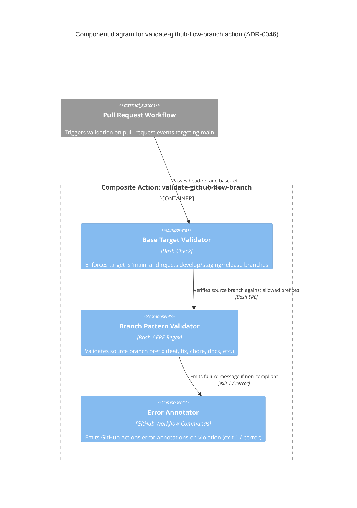

# validate-git-flow-branch-order--workflow-action

Composite GitHub Action that enforces **GitHub Flow** branch conventions ([ADR-0046](https://github.com/tibuqx/swe-playbook--docs/blob/main/adrs/devops/0046-standardize-on-github-flow-only.md)) on pull requests:

```
<short-lived-branch>  ──►  main
```

Fails the step (exit code 1) and emits a GitHub Actions error annotation when:
1. A pull request targets forbidden/deprecated branches (`develop`, `staging`, `release/*`, `hotfix/*`).
2. A branch name violates the approved short-lived prefix convention (`feat/*`, `fix/*`, `chore/*`, `docs/*`, `style/*`, `refactor/*`, `perf/*`, `test/*`, `ci/*`, `build/*`, `dependabot/*`).
3. A pull request attempts to merge `main` into `main`.

---

## Architecture & Component Flow



---

## Usage

In your repository's `.github/workflows/pipeline.yml` (or PR validation workflow):

```yaml
name: CI/CD Pipeline

on:
  pull_request:
    branches: [main]

jobs:
  ci:
    runs-on: ubuntu-latest
    steps:
      - name: Validate GitHub Flow Branch (ADR-0046)
        uses: tibuqx/validate-git-flow-branch-order--workflow-action@v2
        with:
          head-ref: ${{ github.head_ref }}
          base-ref: ${{ github.base_ref }}
```

---

## Allowed Branch Prefixes

Under **ADR-0046**, `main` is the only permanent branch. All contributions must use short-lived branches with approved prefixes:

| Branch Prefix | Purpose |
|---|---|
| `feat/*` | New feature or capability |
| `fix/*` | Bug fix |
| `chore/*` | Maintenance, configuration, dependencies |
| `docs/*` | Documentation changes |
| `style/*` | Code style, formatting, UI CSS adjustments |
| `refactor/*` | Code restructuring without behavior changes |
| `perf/*` | Performance optimizations |
| `test/*` | Adding or updating tests |
| `ci/*` | CI/CD pipeline and automation changes |
| `build/*` | Build toolchain and dependencies |
| `dependabot/*` | Automated Dependabot dependency updates |

---

## Inputs

| Name | Required | Default | Description |
|---|---|---|---|
| `head-ref` | **Yes** | `N/A` | Source branch of the pull request (pass `github.head_ref`). |
| `base-ref` | **Yes** | `N/A` | Target branch of the pull request (pass `github.base_ref`). |
| `allowed-base-branch` | No | `main` | Allowed target base branch for GitHub Flow. |
| `feature-branch-pattern` | No | `^(feat|feature|fix|bugfix|hotfix|chore|docs|style|refactor|perf|test|ci|build|dependabot)/.+` | ERE regex matched against head ref. |

---

## Backstage Integration

This repository is registered in Backstage as `validate-git-flow-branch-order--workflow-action` (`catalog-info.yaml`).
\n