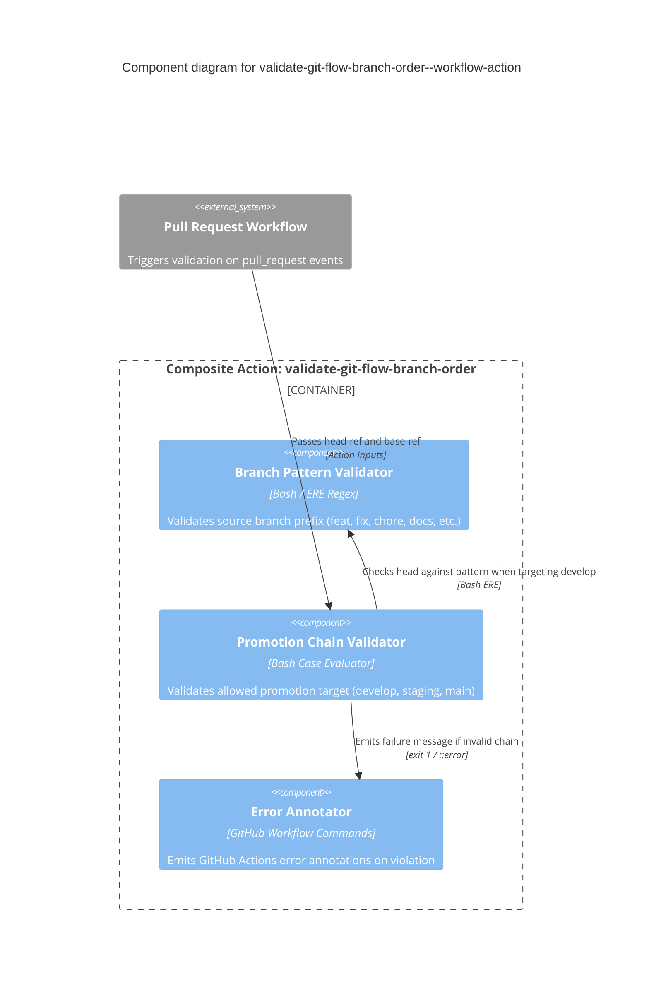

# validate-git-flow-branch-order--workflow-action

Composite GitHub Action that enforces GitFlow branch promotion order on pull requests:

```
<feature-branch>  ──►  develop  ──►  staging  ──►  main
```

Fails the step (exit code 1) and emits a GitHub Actions error annotation when a pull request attempts to bypass required promotion stages.

---

## Architecture & Component Flow



---

## Usage

In your repository's `.github/workflows/` directory, add the action to your PR validation workflow:

```yaml
name: Validate PR Branch Order

on:
  pull_request:
    branches: [develop, staging, main]

jobs:
  validate-branch:
    runs-on: ubuntu-latest
    steps:
      - name: Validate GitFlow branch order
        uses: tibuqx/validate-git-flow-branch-order--workflow-action@v1
        with:
          head-ref: ${{ github.head_ref }}
          base-ref: ${{ github.base_ref }}
```

---

## Allowed Merge Paths

| Base (Target) | Allowed Head (Source) Pattern | Description |
|---|---|---|
| `develop` | `feat/*`, `fix/*`, `chore/*`, `docs/*`, `refactor/*`, `test/*`, `ci/*`, `build/*` | Feature and fix branches |
| `staging` | `develop` | Release candidate integration |
| `main` | `staging` | Production release |

---

## Inputs

| Name | Required | Default | Description |
|---|---|---|---|
| `head-ref` | **Yes** | `N/A` | Source branch of the pull request (pass `github.head_ref`). |
| `base-ref` | **Yes** | `N/A` | Target branch of the pull request (pass `github.base_ref`). |
| `feature-branch-pattern` | No | `^(feat|feature|fix|bugfix|hotfix|chore|docs|refactor|test|ci|build)/.+` | ERE regex matched against head ref when targeting develop. |

---

## Backstage Integration

This repository is registered in Backstage as `validate-git-flow-branch-order--workflow-action` (`catalog-info.yaml`).\n